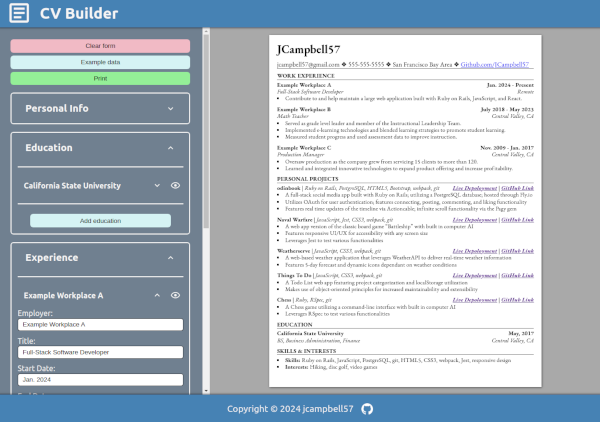
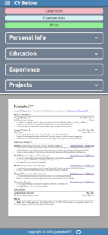

# CV Builder

## Project info

An application where users can input their information to generate a CV/résumé. The purpose of this project is to practing developing with react state and props.

Project description can be found [here](https://www.theodinproject.com/lessons/react-new-cv-application#project-solution)

## Live demo

Live demo available via [Netlify](https://fascinating-pegasus-6a0514.netlify.app/)

## Table of Contents

* [Features](#features)
* [Technologies utilized](#technologies-utilized)
* [Learning outcomes](#learning-outcomes)
* [Project screenshots](#project-screenshots)
* [Behind the Scenes](#behind-the-scenes)
* [Installation](#installation)

## Features

- Real-time visualization
- collapsible form sections
- ability to toggle visibility of education, experience, and projects
- ability to print completed resume (or print to PDF)
- localStorage integration so the user can leave and come back without losing changes
- mobile friendly responsive styling

## Technologies utilized

- HTML5
- CSS3
- React
- JSON
- Vite

## Learning outcomes

This project helped to reinforce the following skills:

- React state and props
- JSON serialization
- localStorage integration
- responsive styling

## Project Screenshots

### CV Builder (desktop & mobile)

 

## Behind the scenes

### Notes

- One of the biggest challenges with this project seems to be styling the resume preview to closely match what is actually printed on many different screen sizes. I suspect the solution will involve adding more media queries to handle each screen size.

### Improvements

This project could be improved with:

- A drag and drop feature to reorder sections, or entries within each section.
  - [dnd kit](https://dndkit.com/) may be a good solution for this with [multiple vertical containers](https://master--5fc05e08a4a65d0021ae0bf2.chromatic.com/?path=/story/presets-sortable-multiple-containers--vertical).
  - [this project](https://github.com/eldarlrd/cv-maker) may be a good one to reference when implementing dnd kit
- styling to show content on second page when there is not enough room to fit everything on one page.
  - [This stackoverflow thread](https://stackoverflow.com/questions/34774962/on-overflow-create-a-new-div-and-transfer-overflow-text-to-the-new-div) may be helpful for this.
- animations when expanding or collapsing form sections.

### Development

- run `npm run dev` to see changes during development

### Resources

- [This TOP lesson](https://www.theodinproject.com/lessons/react-new-setting-up-a-react-environment) was helpful for initiating a new react project.
- [Material Design Icons](https://pictogrammers.com/library/mdi/) for SVG icons.
- Resume designed to match the popular [Sheets & Giggles resime template](https://sheetsresume.com/resume-template/) from [this Reddit post](https://www.reddit.com/r/jobs/comments/7y8k6p/im_an_exrecruiter_for_some_of_the_top_companies/).
- [uuid](https://www.npmjs.com/package/uuid) was unitilized for unique keys.

## Installation

- Clone this repository to your desktop.
- Navigate to the top level of the directory by running `cd cv-builder`.
- Run `npm install` to install the required dependencies.  
- Open http://localhost:5173/ in your browser.
- Run `npm run dev` to see your changes after each save.
